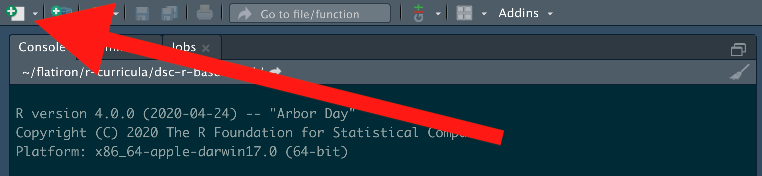
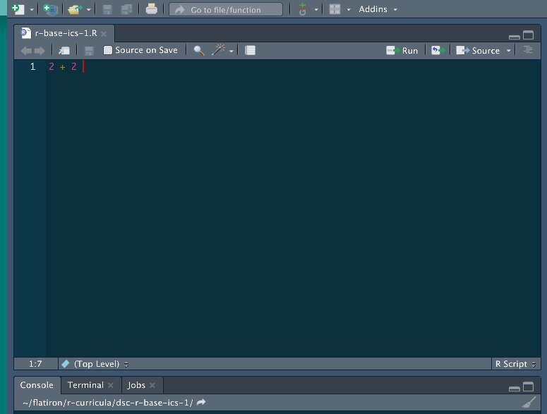

# Base R Basics I 

## TO DO

* [ ] Edit Text
* [ ] Add in clear def of vector, dataframe, list 
* [ ] Create Matched RMarkdown 

## Introduction

In this lesson we're going to explore some of the basic functionality of what makes R, R!

## Learning Objectives 

By the end of this lesson, you will be able to: 

* [ ] Describe basic similarities and differences between R and Python code 
* [ ] See an example of element-wise execution in R
* [ ] Learn to identify what a vector in R
* [ ] Learn to identify what a data frame is in R
* [ ] Subset an R object using the square bracket operators
* [ ] Use the `$` to subset a vector from a data frame
* [ ] Identify where to go to learn more about R's data structures. 


## Getting Comfortable 

Now that we have R and RStudio installed, let's write some code and see R in action!
For these exercises, you will be able to run most of these commands in RStudio.
There is an accompanying `.Rmd` file for each of these lessons in each repo!
Feel free to use this to run each command after reading these REAMDEs.

Let's start typing some R code!
In order to get practice working in RStudio, we suggest typing out this code in the RStudio script editor (the top left panel in RStudio).

In order to make a new script you need to click the little green icon in the top left corner and select NEW SCRIPT.

 

What is great about RStudio is that you can run any line of your script, just like you can run any cell in a Jupyter Notebook, individually.
If you hold down `CMD` and press `RETURN` on any selected line in the editor, you can run a line.
We'll try this together.

## First Commands

Like before, let's try to type in some basic math into R.
Instead of just typing it into the Console, let's instead write out a line in a new script.

Again, let's just add two numbers.

```{r}
2 + 2 
```

In RStudio it might look like this: 

 

We can run this line by typing `CMD + RETURN` assuming that the cursor is on the line you want to run.
This will send this line of output to be run through the console. 
Notice that your output is now shown below. 

Not that impressive, most programming langues can do that!
Let's now write something that actually looks like R.

```{r}
my_number <- 2 + 2
```

Let's now run this code here that saves our operation into an object.
Now don't just run it right away, let's take a second to think about what is the same and different as Python.
As with Python, we are assigning some sort of expression to an object.
The naming conventions of objects in R as pretty much the same as Python, but notice that in R we use the assignment operator `<-` as opposed to equals `=`.
There are a couple of different reasons why this is.
The easy answer as to why this is, is because this is part of R's [style guide](). 
The reason why this is is because... (addition in math language).

Now as we run this line, we know from before that it will get sent to the console.
So knowing that we know what will happen, let's instead direct our attention to the top right panel when we run this.
This top right panel is our Global Environment and keeps track of what variables are in our work space.


If you did this, you screen will look something like above.
The command was sent below and we now have a new value in our Global environment.

Just like in Python, we can now manipulate this new object.
For example if we did:

```{r}
my_number * 2
```

Our number, 4, would get multiplied by 2 just like in Python!

But we know now that in data science, we don't usually want to multiply just ONE number, but rather a whole collection of numbers.
This is where R's differences start to show.

Let's now make a vector (what R calls a one dimensional collection of objects of the same type) of a some numbers using R's `c()` function. 
We can pretend this is a bunch of data on the number of coffees you might drink in a day.

```{r}
coffees <- c(2,1,2,3,1,2,0,2,3,1)
```

Now if we were in Python, this might start out a as a list and we'd have to numpyifiy it in order to do some math operations on it.
Since is a programming language that really is designed for manipulating numbers, we don't have to do something equivalent.
Let's imagine we're trying to calculate how much caffeine we've taken in each day and realized that mug we're drinking out of is actually a little big bigger than the normal cup so we need to scale our entire data by a factor of 1.2.
We can just multiply the whole object by 1.2.

```{r}
coffees * 1.2
```

If you run this, you'll notice that it ran just fine.
No need to turn a list into a numpy array.

This works because R uses `element-wise execution`.
If you want to read more about this, check out this chapter on [The Very Basics of R](https://rstudio-education.github.io/hopr/basics.html#objects) by Garrett Grolemund. 
There's a lot of other strange (if you're a Pythonista) results that happen when you have this as a basic feature of the language. 

Let's save our new output into a new variable.

```{r}
adjusted_coffees <- coffees * 1.2
```

Now it might seems a bit extra to have two objects of two things that are related not as part of the same entity.
Since they are two vectors of the same length, we can combine them into a data frame. 
In order to do this, let's make a new object with the `data.frame()` function. 

```{r}
coffee_data <- data.frame(coffees, adjusted_coffees)

coffee_data
``` 

If we now run `coffee_data` in RStudio, we can see something that looks like what we're more familiar with.


Now in general you won't build up data frames like this in R, we just want to show some of the parts and terms of data frames before you start working with them! 

## Accessing Data

At this point `coffee_data` should look pretty familiar as the kind of tabular data you're used to working with.
So how do you then subset/index parts of `coffeed_data`?
There are a couple of ways to do this with base R, but in the next few lessons, we'll explore a way of doing this that is a bit easier to read.

The way to get subsets of data from an R object is with the square bracket operators.
When using the square brackets `[` and `]`, the first argument will correspond to rows and the second to columns.
For example, if we wanted to get the first row from our coffee data we would index our data by typing:

```{r}
coffee_data[1,]
```

After months of Python, this might be a bit jarring to see.
Yes, R is 1 as opposed to 0 index.
If you want the first element of an ordered object in R you use the number 1.

Notice here that there is a comma that lets R know that we're operating on a two dimensional object (it has rows and columns).
Also notice that since we want all other columns, we leave everything after the comma blank.

If we instead wanted just the first column, we would type: 

```{r}
coffee_data[,1]
```

And if we wanted the data from the first row and first column, we would type:

```{r}
coffee_data[1,1]
```

There are other ways to get data out of a data frame and the last thing we'll show you is one way to extract a column from a data frame.
If you want to, for example, grab out the column `coffees`, we can use the `$` to do this.

```{r}
coffee_data$coffees
```

This will print out our original data from before.
And if we wanted to get just the first entry of this, we could again use the `[ ]`, but since we have only one dimension here, we don't need the comma `,`.

```{r}
coffee_data$coffees[1]
```

Just like Python, there are many, many ways to expand this out to get the data you might want and you can read about it [here if you would like](https://rstudio-education.github.io/hopr/), but in the later R lessons, we're actually going to focus on a different way of working with R to chop up data. 


## Conclusion

We've just covered a lot! 
We learned about some of the basic data structures in R such as data frames and vectors, as well as how to index data out of that data.
Now we know that R uses element-wise execution in how it works and we'll soon learn that this element-wise execution is closely related to what makes fast R code which is [vectorization](https://rstudio-education.github.io/hopr/speed.html#vectorized-code).
